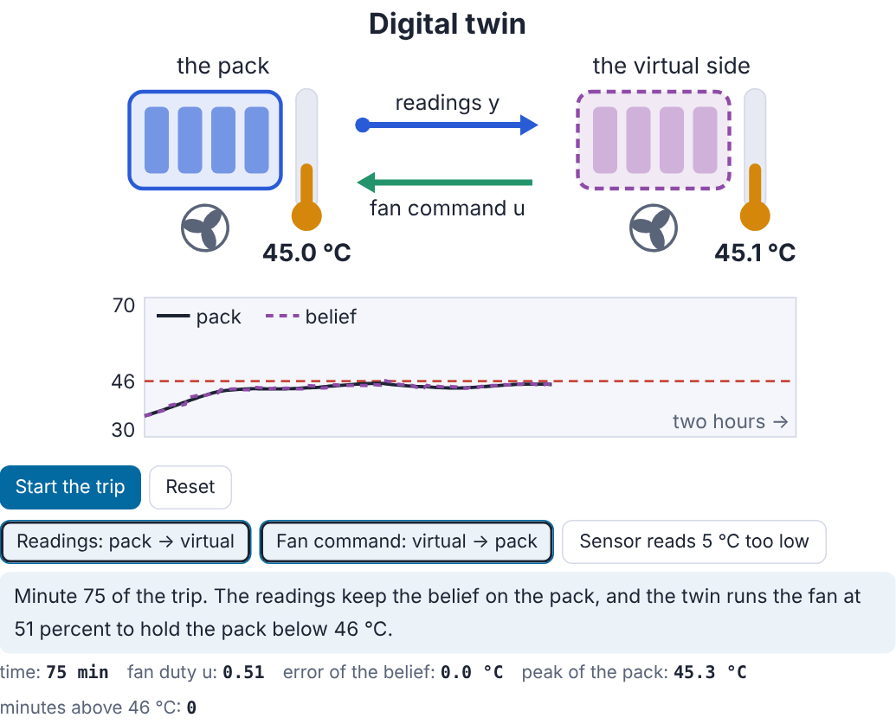
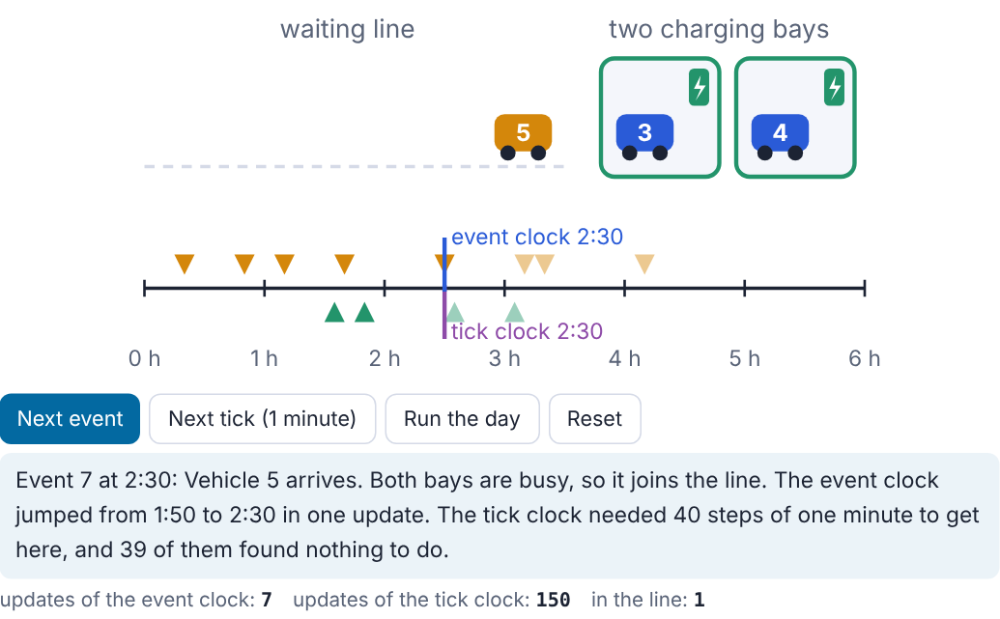
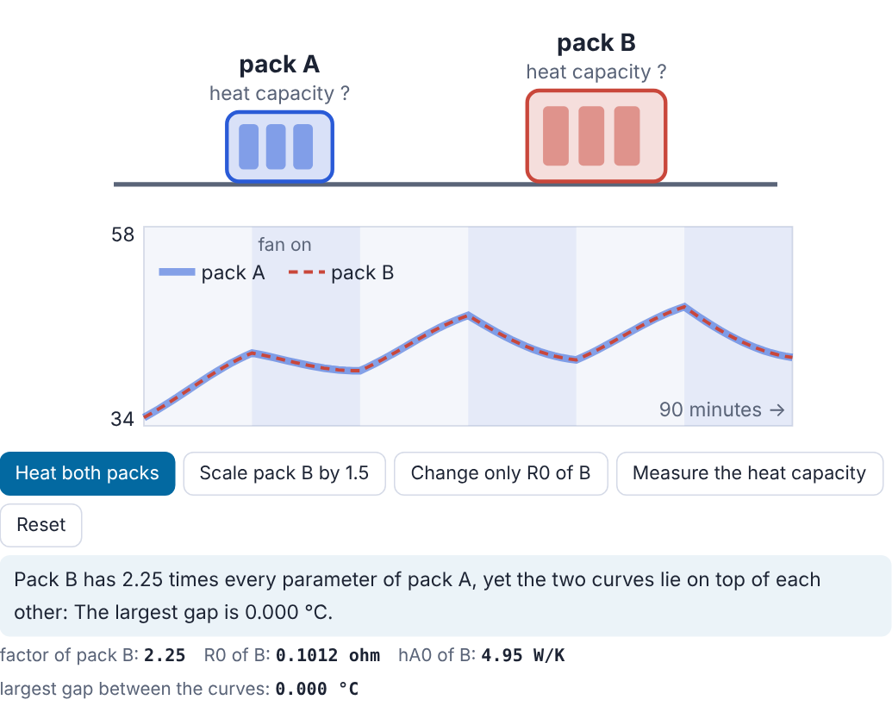
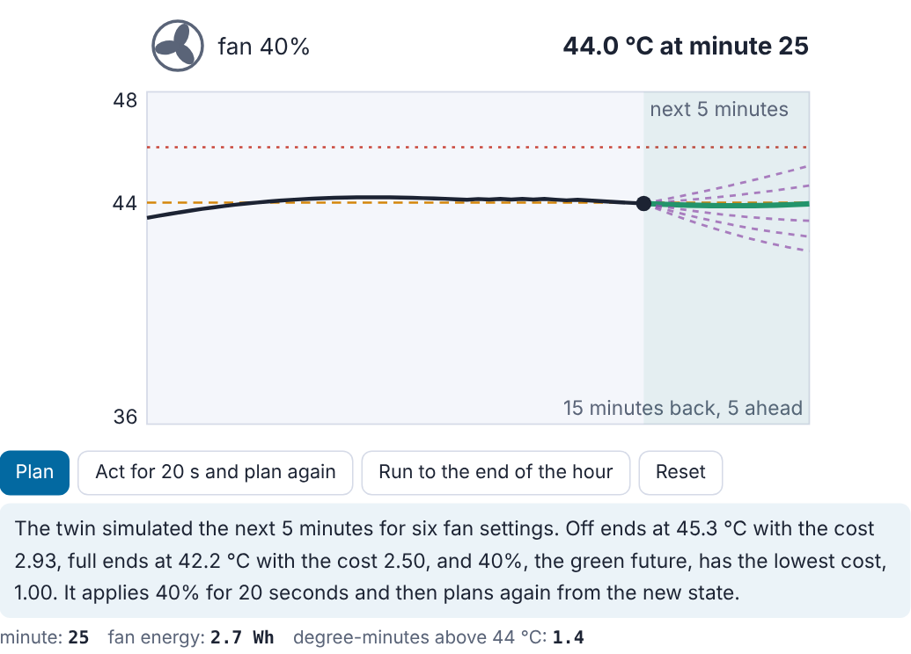
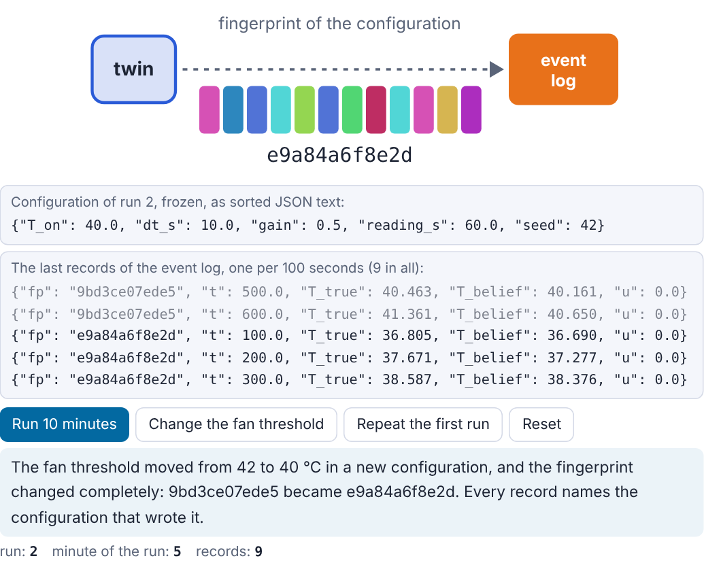
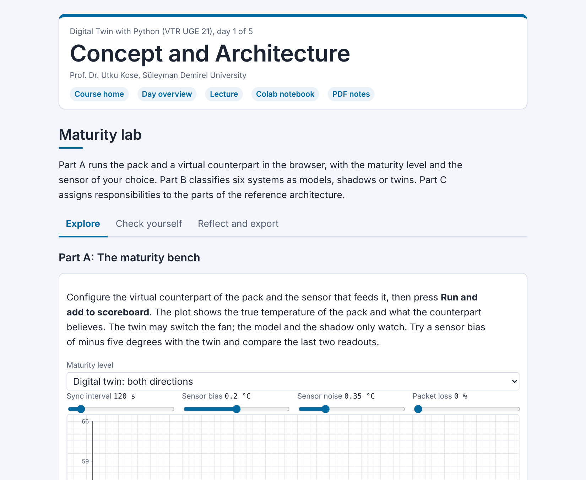
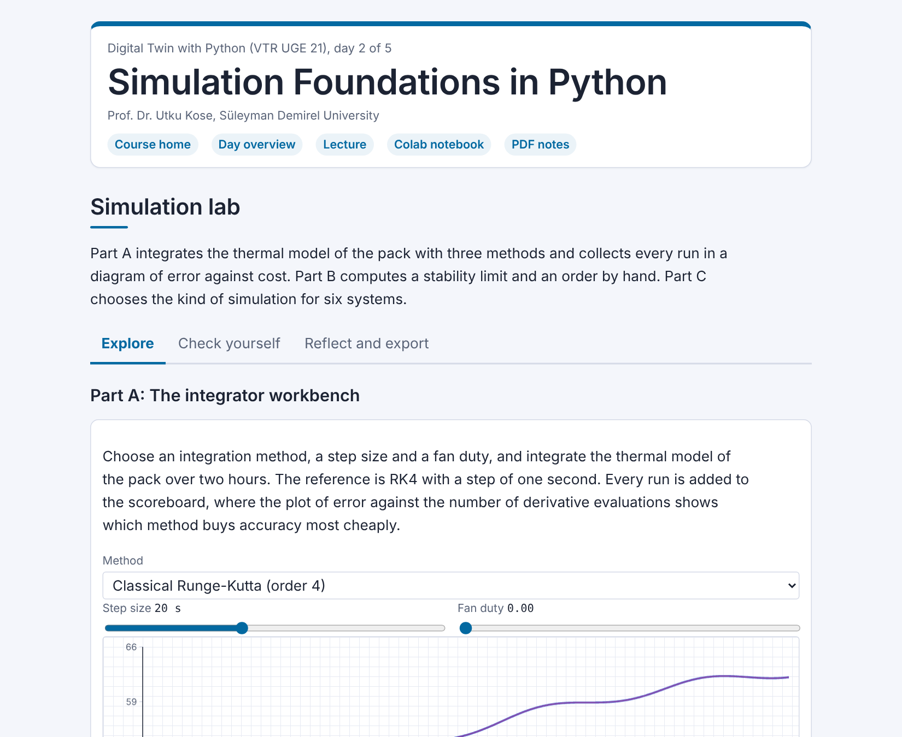
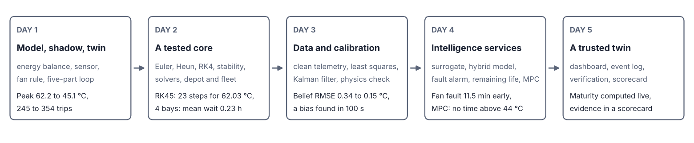

# Digital Twin with Python

**VTR UGE 21 Value Added Course, Vel Tech Rangarajan Dr. Sagunthala R&D Institute of Science and Technology, Chennai, India**

*A five-day course on building software digital twins in Python, with lecture pages, animations, interactive labs, Colab notebooks and a Python track for beginners*

      

**This course is updated in line with current developments in the field. Last update: October 2026.**

**Prof. Dr. Utku Kose**

Full Professor, Department of Computer Engineering, Süleyman Demirel University, Isparta, Türkiye  
Founding Director, AI Application and Research Center (YAZEM), Süleyman Demirel University  
Head of the Computer Science Division, Department of Computer Engineering, Süleyman Demirel University  
Additional affiliations: University of North Dakota (USA), Universidad Panamericana (Mexico City, Mexico), Vel Tech University (Chennai, India)  
IEEE Senior Member, ACM Professional Member

[ORCID 0000-0002-9652-6415](https://orcid.org/0000-0002-9652-6415) | [utkukose.com](https://www.utkukose.com) | [github.com/utkukose](https://github.com/utkukose)

[utkukose@sdu.edu.tr](mailto:utkukose@sdu.edu.tr) | [utku.kose@und.edu](mailto:utku.kose@und.edu) | [ukose@up.edu.mx](mailto:ukose@up.edu.mx) | [utkukose@gmail.com](mailto:utkukose@gmail.com)

## About the course

A digital twin is a virtual counterpart of a specific physical asset that is kept in step with it by data and, in its full form, acts back on it [1, 2]. The course builds one complete software twin in five days, always of the same asset: A 48 V lithium-ion battery pack with electrical, thermal and ageing dynamics on three time scales. Day 1 measures the difference between a digital model, a digital shadow and a digital twin and sets up a reference architecture [3, 4]. Day 2 builds the simulation core and tests it, Day 3 turns noisy telemetry into calibrated parameters, Day 4 adds surrogates, hybrid models, anomaly detection, prognostics and control [5, 6], and Day 5 adds the dashboard, the logs and a credibility assessment [7]. The asset and every sensor are simulated, which is how digital twins are developed before hardware is available, and the limits of that approach are stated as part of the course.

## Use in other courses

These materials were prepared for the value added course Digital Twin with Python delivered at Vel Tech Rangarajan Dr. Sagunthala R&D Institute of Science and Technology. They are openly available: Anyone may use and adapt them in courses of related content, at any level, with attribution as described in the license section. Instructors who adopt them are welcome to report errors or suggest improvements through the issues of this repository.

## A look inside

Every lecture page holds an interactive scene that turns a central idea of the day into a small story with buttons. A click on a picture opens its scene on the lecture page.

<table><tr><td width="33%" valign="top"> Day 1: Two arrows</td><td width="33%" valign="top"> Day 2: Two clocks</td><td width="33%" valign="top"> Day 3: Two packs, one curve</td></tr><tr><td width="33%" valign="top"> Day 4: Looking ahead</td><td width="33%" valign="top"> Day 5: The event log</td></tr></table>

The interactive labs of the first three days, as they appear in the browser.

<table><tr><td width="33%"> Day 1: Maturity lab</td><td width="33%"> Day 2: Simulation lab</td><td width="33%"> Day 3: Calibration lab</td></tr></table>

## Who the course is for

The course is written for undergraduate and graduate students of engineering and science programmes and for self-learners anywhere. It assumes no earlier programming experience: The start-here notebook and the five Python steps teach the Python needed for the course through the battery pack itself. Students who already program in Python can treat the Python steps as a quick review and spend the time on the exercises and the application challenges.

## Course learning outcomes

On completion, students are expected to distinguish a digital model, a digital shadow and a digital twin by their data flows and measure the difference, to write a physical model with stated assumptions and integrate it with a method whose order and stability they have verified, to build a telemetry pipeline and identify model parameters with an identifiability check and honest uncertainty, to add a surrogate, a hybrid model, a residual-based anomaly detector, a prognostic and a closed-loop controller, each measured against a baseline, and to assemble the whole into one twin with a dashboard, logs and a credibility scorecard. In Python, students are expected to use variables, lists, loops, functions and dictionaries, NumPy arrays, pandas data frames with time indices, Matplotlib plots, the scikit-learn interface, classes and dataclasses.

## How the course works

Each day has an overview page in its folder, which links to four materials with distinct roles. The lecture page explains the concepts with animations, knowledge checks and review cards. The Colab notebook holds the Python step and the hands-on work on the battery pack. Its exercises give immediate feedback, reference solutions sit in collapsed cells, and open questions invite observations on the results. Each section links back to the part of the lecture it applies, and each can be started on its own, because its first cell runs the code of the earlier sections. The interactive lab practises the ideas in several parts: A simulation of the battery pack that runs in the browser, a short classification task, a calculation by hand, and calculators that repeat the worked examples of the lecture step by step, with sliders for their numbers. The lecture page opens each part at the place where it belongs. The lab closes with a self-assessment and an exportable learning log. The PDF lecture notes collect the lecture and the Python step in one printable file. The course works in two modes. In a synchronous delivery, each day runs as one session of about three hours, following the live session plan on the overview page. In asynchronous study, the same materials are used along the study path on the overview page, which lists every activity with a suggested time.

Start with [`start-here/`](start-here/README.md) if you have never programmed, then follow the days in order. The course site at <https://utkukose.github.io/digital-twin-veltech-NB-lecture/> links every page and keeps track of the days you have completed in your browser.

## The twin of the pack, the project of the course, day by day

One project runs through the whole week: a digital twin of the 48 V battery pack, built one stage per day. Each day first teaches its methods on small examples and then takes the twin one stage further, in a lecture section titled *The twin of the pack, stage N*. The figure shows the five stages, and the table links each stage to its section.

| Day | Stage of the project | Methods | Result |
|---|---|---|---|
| [Day 1](https://utkukose.github.io/digital-twin-veltech-NB-lecture/days/day-01/lecture.html#the-twin-of-the-pack-stage-1-a-twin-that-keeps-the-pack-below-its-limit) | A model of the pack, a sensor with its faults and a virtual counterpart that predicts, corrects and acts once per second. | Energy balance, digital model, shadow and twin, a fan rule, a reference architecture of five parts | Peak 45.1 instead of 62.2 °C and 354 instead of 245 trips; a sensor bias of −5 °C hides 95 minutes above the limit |
| [Day 2](https://utkukose.github.io/digital-twin-veltech-NB-lecture/days/day-02/lecture.html#the-twin-of-the-pack-stage-2-a-simulation-core-that-is-measured-and-tested) | The numerical integration behind every value of the twin is measured, tested and protected. | Euler, Heun and Runge-Kutta methods, order of accuracy, stability limit, adaptive solvers, discrete-event and agent-based simulation | Euler stable only below 1268 s at full fan; RK45 needs 23 steps for the trip of two hours; four bays give a mean wait of 0.23 h |
| [Day 3](https://utkukose.github.io/digital-twin-veltech-NB-lecture/days/day-03/lecture.html#the-twin-of-the-pack-stage-3-clean-data-calibrated-parameters-and-a-filtered-belief) | The readings are cleaned, the parameters calibrated, and the belief becomes a weighted mix of model and reading. | A telemetry buffer, spike and drift checks, least squares with an identifiability check, a separate measurement of the heat capacity, a Kalman filter | Belief RMSE 0.154 instead of 0.341 °C; a sensor bias of −3 °C found within 100 s |
| [Day 4](https://utkukose.github.io/digital-twin-veltech-NB-lecture/days/day-04/lecture.html#the-twin-of-the-pack-stage-4-services-that-answer-warn-and-decide) | The calibrated model answers questions, warns of faults, estimates the remaining life and plans the fan. | A Gaussian-process surrogate, a hybrid model, a cumulative sum, the remaining useful life with a bootstrap interval, model predictive control | A degraded fan seen 11.5 minutes before the fixed limit; planning the fan beats the fixed rule by 51 percent of the objective |
| [Day 5](https://utkukose.github.io/digital-twin-veltech-NB-lecture/days/day-05/lecture.html#the-twin-of-the-pack-stage-5-a-twin-that-knows-how-far-it-can-be-trusted) | The parts run as one twin that computes its own maturity, logs every step and collects the evidence of its credibility. | A dashboard, computed maturity, a frozen configuration with an event log, verification and validation, a credibility scorecard, a fail-safe policy | Five of ten elements of the scorecard pass; under a fault the twin withdraws its trust after 26 minutes and cools at full speed |

The final project asks each student to take an asset of their own along the same five stages, with both data flows, a tested core, calibrated parameters, at least two services measured against a baseline and a credibility scorecard with its open items.

## Daily schedule

| Day | Topic | Overview | Lecture | Lab | Notebook | PDF |
|---|---|---|---|---|---|---|
| 1 | Concept and Architecture | [overview](days/day-01/README.md) | [lecture](https://utkukose.github.io/digital-twin-veltech-NB-lecture/days/day-01/lecture.html) | [lab](https://utkukose.github.io/digital-twin-veltech-NB-lecture/days/day-01/lab.html) |  | [PDF](days/day-01/Day01_Lecture_Notes.pdf) |
| 2 | Simulation Foundations in Python | [overview](days/day-02/README.md) | [lecture](https://utkukose.github.io/digital-twin-veltech-NB-lecture/days/day-02/lecture.html) | [lab](https://utkukose.github.io/digital-twin-veltech-NB-lecture/days/day-02/lab.html) |  | [PDF](days/day-02/Day02_Lecture_Notes.pdf) |
| 3 | Data Pipelines and Model Calibration | [overview](days/day-03/README.md) | [lecture](https://utkukose.github.io/digital-twin-veltech-NB-lecture/days/day-03/lecture.html) | [lab](https://utkukose.github.io/digital-twin-veltech-NB-lecture/days/day-03/lab.html) |  | [PDF](days/day-03/Day03_Lecture_Notes.pdf) |
| 4 | Intelligence Layer of the Twin | [overview](days/day-04/README.md) | [lecture](https://utkukose.github.io/digital-twin-veltech-NB-lecture/days/day-04/lecture.html) | [lab](https://utkukose.github.io/digital-twin-veltech-NB-lecture/days/day-04/lab.html) |  | [PDF](days/day-04/Day04_Lecture_Notes.pdf) |
| 5 | Visualization and Capstone Development | [overview](days/day-05/README.md) | [lecture](https://utkukose.github.io/digital-twin-veltech-NB-lecture/days/day-05/lecture.html) | [lab](https://utkukose.github.io/digital-twin-veltech-NB-lecture/days/day-05/lab.html) |  | [PDF](days/day-05/Day05_Lecture_Notes.pdf) |

## Python for non-programmers

Python is taught step by step alongside the content of the course, always through the tool that the twin of the day needs [8]. Every day has a Python step in its notebook, right after the setup cell, that explains one group of fundamentals with the battery pack in runnable cells and closes with a quick check and three exercises. The five steps lead from values, variables, lists and decisions on Day 1, through NumPy arrays and functions that receive other functions, pandas data frames with time, plots and the scikit-learn interface, to classes and files on Day 5 [9, 10, 11].

The full sequence is described in [`PYTHON_PATH.md`](PYTHON_PATH.md).

## Assessment and submission

Assessment rests on a final project, a working digital twin of an asset of the student's choice with a credibility scorecard, which consists of a coding application and a short technical report. Each day also offers an optional task, an optional research and report assignment and a self-assessment in the lab. During an active delivery of the course, components and weights are announced by the instructor at the start of the course in line with the regulations of Vel Tech University, and the daily task can be sent together with the exported learning log to utkukose@sdu.edu.tr or utkukose@gmail.com. The self-assessments are formative and do not count towards the grade.

| Component | Timing | Format | Page |
|---|---|---|---|
| Daily task and learning log | End of each day | Short coding task and exported log | each day folder |
| Final project: A digital twin with a credibility scorecard | One week after Day 5 | Coding application and technical report | [open](exams/final/README.md) |

A common structure for reports is given in [exams/REPORT_TEMPLATE.md](exams/REPORT_TEMPLATE.md). The syllabus in [SYLLABUS.md](SYLLABUS.md) states the policies, including the rules for using generative AI tools.

## Running the materials

The notebooks run in Google Colab through the badge of each day, with no installation at all: The course uses only NumPy, pandas, SciPy, Matplotlib, scikit-learn and ipywidgets. For local work on Windows or Ubuntu, create a virtual environment with `python -m venv .venv`, activate it, run `pip install -r requirements.txt` and start `jupyter lab`. The lecture pages and labs open in any modern browser and keep progress only in the browser.

## Reference integrity

All references were checked before release. Entries with a link in `references/REFERENCES.md` were confirmed against that DOI or publisher page during preparation, and the remaining entries are fully citable from the details given. No locator was reconstructed from memory. As an independent check, `tools/verify_references.py` compares every entry with Crossref and OpenAlex, and the GitHub Actions workflow runs it monthly and on every change of the references.

## Citing this course

Citation metadata is provided in `CITATION.cff`. A suggested citation is:

> Kose, U. (2026). *Digital Twin with Python: Open course materials* [Course materials]. GitHub. https://github.com/utkukose/digital-twin-veltech-NB-lecture

## License

The course text, figures, lecture notes and interactive labs are licensed under the Creative Commons Attribution 4.0 International License (CC BY 4.0), as stated in `LICENSE-CONTENT`. The code in the notebooks, labs and tools is licensed under the MIT License, as stated in `LICENSE`.

## References cited on this page

[1] Grieves, M., & Vickers, J. (2017). Digital twin: Mitigating unpredictable, undesirable emergent behavior in complex systems. In F.-J. Kahlen, S. Flumerfelt & A. Alves (Eds.), Transdisciplinary Perspectives on Complex Systems (pp. 85-113). Springer.

[2] Kritzinger, W., Karner, M., Traar, G., Henjes, J., & Sihn, W. (2018). Digital Twin in manufacturing: A categorical literature review and classification. IFAC-PapersOnLine, 51(11), 1016-1022. <https://doi.org/10.1016/j.ifacol.2018.08.474>

[3] Tao, F., Xiao, B., Qi, Q., Cheng, J., & Ji, P. (2022). Digital twin modeling. Journal of Manufacturing Systems, 64, 372-389.

[4] Qi, Q., Tao, F., Hu, T., Anwer, N., Liu, A., Wei, Y., Wang, L., & Nee, A. Y. C. (2021). Enabling technologies and tools for digital twin. Journal of Manufacturing Systems, 58, 3-21.

[5] Raissi, M., Perdikaris, P., & Karniadakis, G. E. (2019). Physics-informed neural networks: A deep learning framework for solving forward and inverse problems involving nonlinear partial differential equations. Journal of Computational Physics, 378, 686-707. <https://doi.org/10.1016/j.jcp.2018.10.045>

[6] Karniadakis, G. E., Kevrekidis, I. G., Lu, L., Perdikaris, P., Wang, S., & Yang, L. (2021). Physics-informed machine learning. Nature Reviews Physics, 3(6), 422-440.

[7] Roy, C. J., & Oberkampf, W. L. (2011). A comprehensive framework for verification, validation, and uncertainty quantification in scientific computing. Computer Methods in Applied Mechanics and Engineering, 200(25-28), 2131-2144. <https://doi.org/10.1016/j.cma.2011.03.016>

[8] Van Rossum, G., & Drake, F. L. (2009). Python 3 Reference Manual. CreateSpace.

[9] Harris, C. R., Millman, K. J., van der Walt, S. J., Gommers, R., Virtanen, P., Cournapeau, D., Wieser, E., Taylor, J., Berg, S., Smith, N. J., et al. (2020). Array programming with NumPy. Nature, 585(7825), 357-362. <https://doi.org/10.1038/s41586-020-2649-2>

[10] McKinney, W. (2010). Data structures for statistical computing in Python. In Proceedings of the 9th Python in Science Conference (pp. 56-61). <https://doi.org/10.25080/Majora-92bf1922-00a>

[11] Pedregosa, F., Varoquaux, G., Gramfort, A., Michel, V., Thirion, B., Grisel, O., Blondel, M., Prettenhofer, P., Weiss, R., Dubourg, V., Vanderplas, J., Passos, A., Cournapeau, D., Brucher, M., Perrot, M., & Duchesnay, E. (2011). Scikit-learn: Machine learning in Python. Journal of Machine Learning Research, 12, 2825-2830.

---

**Prof. Dr. Utku Kose**

Full Professor, Department of Computer Engineering, Süleyman Demirel University, Isparta, Türkiye  
Founding Director, AI Application and Research Center (YAZEM), Süleyman Demirel University  
Head of the Computer Science Division, Department of Computer Engineering, Süleyman Demirel University  
Additional affiliations: University of North Dakota (USA), Universidad Panamericana (Mexico City, Mexico), Vel Tech University (Chennai, India)  
IEEE Senior Member, ACM Professional Member

[ORCID 0000-0002-9652-6415](https://orcid.org/0000-0002-9652-6415) | [utkukose.com](https://www.utkukose.com) | [github.com/utkukose](https://github.com/utkukose)

[utkukose@sdu.edu.tr](mailto:utkukose@sdu.edu.tr) | [utku.kose@und.edu](mailto:utku.kose@und.edu) | [ukose@up.edu.mx](mailto:ukose@up.edu.mx) | [utkukose@gmail.com](mailto:utkukose@gmail.com)

## Acknowledgments

The course draws on the work of the many researchers cited in the daily references. It was prepared for the value added course programme of the Office of International Relations of Vel Tech Rangarajan Dr. Sagunthala R&D Institute of Science and Technology, Chennai.
