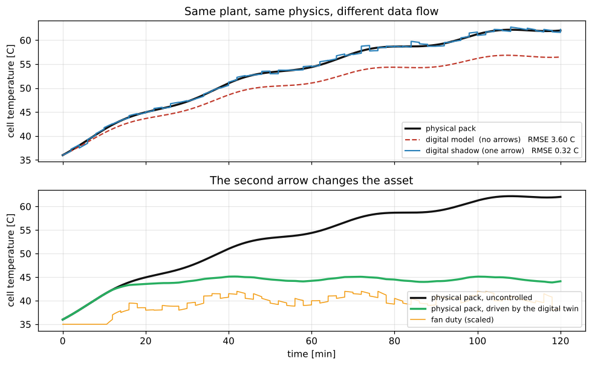

# Day 01: Concept and Architecture

**Digital Twin with Python (VTR UGE 21)**  
Prof. Dr. Utku Kose, Süleyman Demirel University

   

What separates a digital twin from a simulation, measured on one battery pack, and the architecture that holds it. **Estimated study time:** 6 to 8 hours.

## Materials of the day

Each material has its own role. Start with the lecture page; the study path below gives the order and the time of each step.

| Material | What it holds | Open |
|---|---|---|
| Lecture page | The concepts of the day, with animations, an interactive scene, knowledge checks, review cards and the references | [Lecture page](https://utkukose.github.io/digital-twin-veltech-NB-lecture/days/day-01/lecture.html) |
| Colab notebook | Python step 1: Values, variables, lists and decisions, then the hands-on sections with exercises, an application switch and the application challenges |  |
| Interactive lab | Maturity lab: Five practice parts, a self-assessment and an exportable learning log | [Interactive lab](https://utkukose.github.io/digital-twin-veltech-NB-lecture/days/day-01/lab.html) |
| PDF lecture notes | The Python step and the lecture in one printable file | [PDF notes](Day01_Lecture_Notes.pdf) |

<table><tr><td width="50%"> From the Colab notebook</td><td width="50%"> The interactive lab</td></tr></table>

## Learning outcomes

By the end of the day, students are expected to define a digital twin by the data flows between the physical and the virtual entity and distinguish it from a digital model and a digital shadow, to describe the states, inputs, parameters and time scales of the battery pack, to measure the error and the operational benefit of each level of maturity, to choose a synchronisation interval by experiment rather than by intuition, to map an implementation to a five-component reference architecture and to grade a twin against scenarios with a known ground truth. In Python, students are expected to use values, variables, lists, loops, decisions, functions and dictionaries to simulate and control the pack temperature step by step.

## Study path

| Step | Activity | Suggested time |
|---|---|---|
| 1 | Read the [lecture page](https://utkukose.github.io/digital-twin-veltech-NB-lecture/days/day-01/lecture.html) and answer its knowledge checks | 1 hour 30 minutes |
| 2 | Run Python step 1: Values, variables, lists and decisions in the [Colab notebook](https://colab.research.google.com/github/utkukose/digital-twin-veltech-NB-lecture/blob/main/days/day-01/NB01_concept_and_architecture.ipynb#scrollTo=python-step), right after the setup section | 1 hour |
| 3 | Work through parts A to E of the [interactive lab](https://utkukose.github.io/digital-twin-veltech-NB-lecture/days/day-01/lab.html) | 1 hour |
| 4 | Work through the numbered sections of the notebook and their exercises | 2 hours |
| 5 | Use the application switch of the notebook and solve the application challenge of your field | 45 minutes |
| 6 | Take the self-assessment in the [interactive lab](https://utkukose.github.io/digital-twin-veltech-NB-lecture/days/day-01/lab.html) (tab: Check yourself) | 20 minutes |
| 7 | Write the reflection in the lab, export the learning log and complete the daily task below | 45 minutes |

## Live session plan

The day runs as one synchronous session in class or online, and each material has one role in it. The lecture page is on the screen, and at each orange Colab box the instructor shows the matching section in a copy of the notebook that has already been run. Students work in their own copy of the notebook from top to bottom, and each lab part follows the lecture part it practises. The PDF lecture notes serve reading after the session, and the study path above serves self-paced study.

| Time | Activity |
|---|---|
| 0:00 to 0:15 | Opening: Three things called a digital twin, and which of them is one. A tour of the course page, then students open the notebook in Colab, save a copy in Drive and run section 0 |
| 0:15 to 0:50 | Lecture page, part 1: Definitions, the battery pack, what each arrow buys with the three-counterparts animation; then lab Part A with the whole class |
| 0:50 to 1:15 | Colab, together: Python step 1, ending with five steps of the thermal model computed by hand |
| 1:15 to 1:25 | Break |
| 1:25 to 2:00 | Lecture page, part 2: How often to listen with the synchronisation animation, the reference architecture, testing before hardware exists; then lab Part C, the maturity bench with a biased sensor |
| 2:00 to 2:40 | Colab, in pairs: Sections 1 to 6 with their exercises, then section 7 with a different asset for each pair |
| 2:40 to 3:00 | Lab and closing: Part E with the whole class, then the self-assessment; after the session: The PDF notes, the daily task and the optional section 8 |

## Daily task and submission

Add two scenarios of your own to the scenario table of section 6, for example a drifting sensor and an ambient temperature of 42 °C. For each one, report the seconds truly above 46 °C, the seconds reported and the peak temperature, and write about 200 words on which failure is the more dangerous and why.

The task is optional and supports self-learning and a personal portfolio. During an active delivery of the course, it can be sent together with the exported learning log to utkukose@sdu.edu.tr or utkukose@gmail.com.

## Research and report assignment (optional)

**What the literature calls a digital twin.** Select ten recent papers that describe a system as a digital twin and classify each as a model, a shadow or a twin by the data flows it actually implements &#91;[2](https://utkukose.github.io/digital-twin-veltech-NB-lecture/days/day-01/lecture.html#ref-2), [11](https://utkukose.github.io/digital-twin-veltech-NB-lecture/days/day-01/lecture.html#ref-11)&#93;. Report the share in each class and discuss what the misuse of the term costs. The report should be about 1500 words with at least eight sources.
