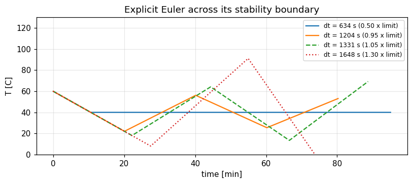

# Day 02: Simulation Foundations in Python

**Digital Twin with Python (VTR UGE 21)**  
Prof. Dr. Utku Kose, Süleyman Demirel University

   

Three ways to simulate an asset, numerical integration with its accuracy and its stability limit, and the simulation of a depot and a fleet. **Estimated study time:** 6 to 8 hours.

## Materials of the day

Each material has its own role. Start with the lecture page; the study path below gives the order and the time of each step.

| Material | What it holds | Open |
|---|---|---|
| Lecture page | The concepts of the day, with animations, an interactive scene, knowledge checks, review cards and the references | [Lecture page](https://utkukose.github.io/digital-twin-veltech-NB-lecture/days/day-02/lecture.html) |
| Colab notebook | Python step 2: NumPy arrays and functions that receive functions, then the hands-on sections with exercises, an application switch and the application challenges |  |
| Interactive lab | Simulation lab: Five practice parts, a self-assessment and an exportable learning log | [Interactive lab](https://utkukose.github.io/digital-twin-veltech-NB-lecture/days/day-02/lab.html) |
| PDF lecture notes | The Python step and the lecture in one printable file | [PDF notes](Day02_Lecture_Notes.pdf) |

<table><tr><td width="50%"> From the Colab notebook</td><td width="50%"> The interactive lab</td></tr></table>

## Learning outcomes

By the end of the day, students are expected to choose between continuous, discrete-event and agent-based simulation for a given question, to estimate the time scales of a model and recognise stiffness, to implement the explicit Euler, Heun and classical Runge-Kutta methods and measure their order of accuracy, to compute the stability limit of explicit Euler and observe what happens beyond it, to compare fixed-step and adaptive solvers by cost and by real-time behaviour, to simulate a queue of vehicles at a charging depot and a fleet of agents, to describe a sensor by its noise, bias, drift, quantisation and dropout, and to protect a simulation core with configuration as data and physical tests. In Python, students are expected to create and use NumPy arrays and to write functions that receive other functions as arguments.

## Study path

| Step | Activity | Suggested time |
|---|---|---|
| 1 | Read the [lecture page](https://utkukose.github.io/digital-twin-veltech-NB-lecture/days/day-02/lecture.html) and answer its knowledge checks | 1 hour 30 minutes |
| 2 | Run Python step 2: NumPy arrays and functions that receive functions in the [Colab notebook](https://colab.research.google.com/github/utkukose/digital-twin-veltech-NB-lecture/blob/main/days/day-02/NB02_simulation_foundations.ipynb#scrollTo=python-step), right after the setup section | 1 hour |
| 3 | Work through parts A to E of the [interactive lab](https://utkukose.github.io/digital-twin-veltech-NB-lecture/days/day-02/lab.html) | 1 hour |
| 4 | Work through the numbered sections of the notebook and their exercises | 2 hours 30 minutes |
| 5 | Use the application switch of the notebook and solve the application challenge of your field | 45 minutes |
| 6 | Take the self-assessment in the [interactive lab](https://utkukose.github.io/digital-twin-veltech-NB-lecture/days/day-02/lab.html) (tab: Check yourself) | 20 minutes |
| 7 | Write the reflection in the lab, export the learning log and complete the daily task below | 45 minutes |

## Live session plan

The day runs as one synchronous session in class or online, and each material has one role in it. The lecture page is on the screen, and at each orange Colab box the instructor shows the matching section in a copy of the notebook that has already been run. Students work in their own copy of the notebook from top to bottom, and each lab part follows the lecture part it practises. The PDF lecture notes serve reading after the session, and the study path above serves self-paced study.

| Time | Activity |
|---|---|
| 0:00 to 0:10 | Opening: Recap of Day 1 and the question of the day: How far can the simulation core be trusted? Students open the notebook in Colab, save a copy and run section 0 |
| 0:10 to 0:50 | Lecture page, part 1: Three ways to simulate, time scales, integration and its order, the stability limit with its animation; then lab Part B, the integrator workbench, on accuracy against cost |
| 0:50 to 1:15 | Colab, together: Python step 2, ending with an order of accuracy measured by hand |
| 1:15 to 1:25 | Break |
| 1:25 to 1:55 | Lecture page, part 2: Adaptive solvers, the depot and the fleet with the depot animation; then lab Part C by hand |
| 1:55 to 2:40 | Colab, in pairs: Sections 1 to 6 with their exercises, then section 7 with a different asset for each pair |
| 2:40 to 3:00 | Lab and closing: Part E with the whole class, then the self-assessment; after the session: The PDF notes, the daily task and the optional section 8 |

## Daily task and submission

Measure the work-precision diagram of the thermal model for the three integrators: For each method, plot the final error after one hour against the number of derivative evaluations, on logarithmic axes, for at least six step sizes. Then write about 200 words recommending one method and one step size for a twin that must update every second on a small embedded processor.

The task is optional and supports self-learning and a personal portfolio. During an active delivery of the course, it can be sent together with the exported learning log to utkukose@sdu.edu.tr or utkukose@gmail.com.

## Research and report assignment (optional)

**Choosing a numerical integrator for a real-time twin.** Review how numerical integration is treated in published real-time digital twins and simulators, including the use of fixed and adaptive steps &#91;[1](https://utkukose.github.io/digital-twin-veltech-NB-lecture/days/day-02/lecture.html#ref-1), [3](https://utkukose.github.io/digital-twin-veltech-NB-lecture/days/day-02/lecture.html#ref-3), [4](https://utkukose.github.io/digital-twin-veltech-NB-lecture/days/day-02/lecture.html#ref-4)&#93;. Classify the systems by stiffness and deadline and derive a decision procedure. The report should be about 1500 words with at least eight sources.
