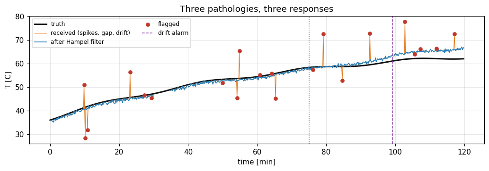
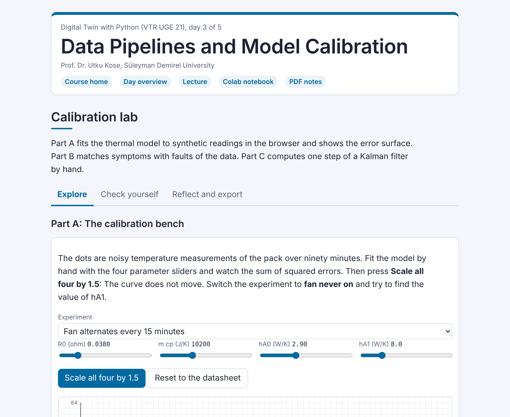

# Day 03: Data Pipelines and Model Calibration

**Digital Twin with Python (VTR UGE 21)**  
Prof. Dr. Utku Kose, Süleyman Demirel University

   

From packets to a clean time series, calibration of the model to its asset, a symmetry that hides parameters, and a Kalman filter that weighs the model against the sensor. **Estimated study time:** 6 to 8 hours.

## Materials of the day

Each material has its own role. Start with the lecture page; the study path below gives the order and the time of each step.

| Material | What it holds | Open |
|---|---|---|
| Lecture page | The concepts of the day, with animations, an interactive scene, knowledge checks, review cards and the references | [Lecture page](https://utkukose.github.io/digital-twin-veltech-NB-lecture/days/day-03/lecture.html) |
| Colab notebook | Python step 3: pandas data frames and time, then the hands-on sections with exercises, an application switch and the application challenges |  |
| Interactive lab | Calibration lab: Six practice parts, a self-assessment and an exportable learning log | [Interactive lab](https://utkukose.github.io/digital-twin-veltech-NB-lecture/days/day-03/lab.html) |
| PDF lecture notes | The lecture and the Python step in one printable file | [PDF notes](Day03_Lecture_Notes.pdf) |

<table><tr><td width="50%"> From the Colab notebook</td><td width="50%"> The interactive lab</td></tr></table>

## Learning outcomes

By the end of the day, students are expected to turn an irregular packet stream into a clean, regular time series and record every intervention, to formulate calibration as a least-squares inverse problem with a designed experiment, to detect structural non-identifiability from the equations of a model and break it with an independent measurement, to assess practical identifiability with a local sensitivity analysis before fitting, to choose between local and global optimisers, to validate a calibrated model on held-out data and check its residuals, to report parameters with bootstrap intervals and explain when those intervals fail, and to implement a scalar Kalman filter and an independent physics check. In Python, students are expected to clean, index, resample, interpolate and smooth time series with pandas.

## Study path

| Step | Activity | Suggested time |
|---|---|---|
| 1 | Read the [lecture page](https://utkukose.github.io/digital-twin-veltech-NB-lecture/days/day-03/lecture.html) and answer its knowledge checks | 1 hour 30 minutes |
| 2 | Work through parts A to F of the [interactive lab](https://utkukose.github.io/digital-twin-veltech-NB-lecture/days/day-03/lab.html) | 1 hour |
| 3 | Run Python step 3: pandas data frames and time in the [Colab notebook](https://colab.research.google.com/github/utkukose/digital-twin-veltech-NB-lecture/blob/main/days/day-03/NB03_data_pipelines_and_calibration.ipynb#scrollTo=python-step), right after the setup cell | 1 hour |
| 4 | Work through the numbered sections of the notebook and their exercises | 2 hours 30 minutes |
| 5 | Use the application switch of the notebook and solve the application challenge of your field | 45 minutes |
| 6 | Take the self-assessment in the [interactive lab](https://utkukose.github.io/digital-twin-veltech-NB-lecture/days/day-03/lab.html) (tab: Check yourself) | 20 minutes |
| 7 | Write the reflection in the lab, export the learning log and complete the daily task below | 45 minutes |

## Live session plan

The day runs as one synchronous session in class or online, and each material has one role in it. The lecture page is on the screen, and at each orange Colab box the instructor shows the matching section in a copy of the notebook that has already been run. Students work in their own copy of the notebook from top to bottom, and each lab part follows the lecture part it practises. The PDF lecture notes serve reading after the session, and the study path above serves self-paced study.

| Time | Activity |
|---|---|
| 0:00 to 0:10 | Opening: Recap of Day 2 and the question of the day: What can the data tell the model? Students open the notebook in Colab, save a copy and run section 0 |
| 0:10 to 0:45 | Lecture page, part 1: From packets to a time series, spikes, gaps and drift with the pipeline animation; then lab Part B with the whole class |
| 0:45 to 1:10 | Colab, together: Python step 3, ending with a resampled and interpolated series |
| 1:10 to 1:20 | Break |
| 1:20 to 2:00 | Lecture page, part 2: Calibration, the hidden symmetry, validation, the Kalman filter with its animation; then lab Part C by hand |
| 2:00 to 2:40 | Colab, in pairs: Sections 1 to 7 with their exercises, then section 8 with a different asset for each pair |
| 2:40 to 3:00 | Lab and closing: Part A, the calibration bench with its sum of squared errors and its three ratios, then the self-assessment; after the session: The PDF notes, the daily task and the optional section 9 |

## Daily task and submission

Repeat the calibration of section 5 with an independent measurement of the heat capacity `m_cp` that is wrong by 5 percent and by 10 percent. Report how the three identified parameters change and explain the result with the ratios of the lecture in about 200 words. Then state which separate measurement you would ask a laboratory for, and why.

The task is optional and supports self-learning and a personal portfolio. During an active delivery of the course, it can be sent together with the exported learning log to utkukose@sdu.edu.tr or utkukose@gmail.com.

## Research and report assignment (optional)

**Identifiability in digital-twin calibration.** Review how structural and practical identifiability are treated in published calibrations of digital twins and grey-box models, which take their equations from physics and their parameters from data &#91;[1](https://utkukose.github.io/digital-twin-veltech-NB-lecture/days/day-03/lecture.html#ref-1), [2](https://utkukose.github.io/digital-twin-veltech-NB-lecture/days/day-03/lecture.html#ref-2), [7](https://utkukose.github.io/digital-twin-veltech-NB-lecture/days/day-03/lecture.html#ref-7)&#93;. Collect examples of symmetries that were broken by independent measurements and of parameters reported without uncertainty. The report should be about 1500 words with at least eight sources.
