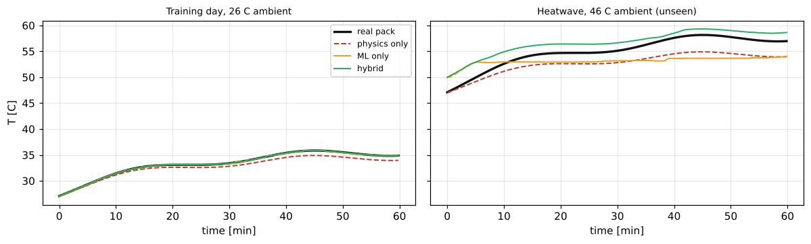
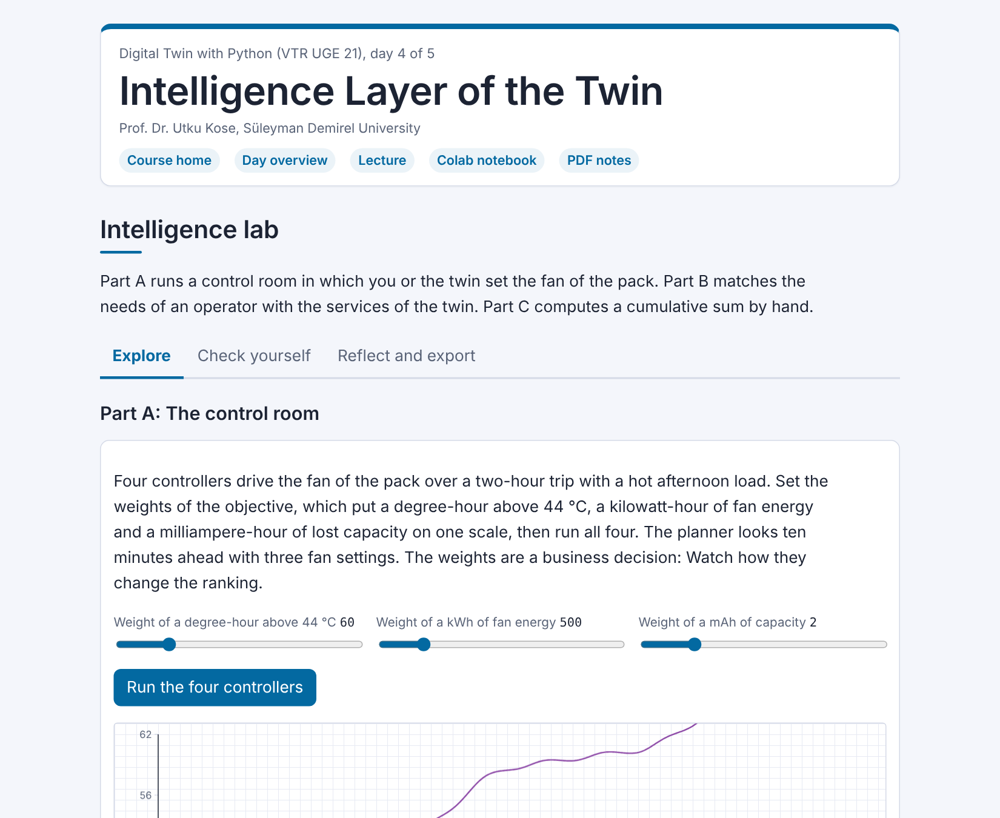

# Day 04: Intelligence Layer of the Twin

**Digital Twin with Python (VTR UGE 21)**  
Prof. Dr. Utku Kose, Süleyman Demirel University

   

Fast surrogates and their limits, hybrid models, fault detection with a cumulative sum, remaining useful life, what-if scenarios and a twin that controls the pack. **Estimated study time:** 6 to 8 hours.

## Materials of the day

Each material has its own role. Start with the lecture page; the study path below gives the order and the time of each step.

| Material | What it holds | Open |
|---|---|---|
| Lecture page | The concepts of the day, with animations, knowledge checks, review cards and the references | [Lecture page](https://utkukose.github.io/digital-twin-veltech-NB-lecture/days/day-04/lecture.html) |
| Colab notebook | Python step 4: Plots and the scikit-learn interface, then the hands-on sections with exercises, an application switch and the application challenges |  |
| Interactive lab | Intelligence lab: Three practice parts, a self-assessment and an exportable learning log | [Interactive lab](https://utkukose.github.io/digital-twin-veltech-NB-lecture/days/day-04/lab.html) |
| PDF lecture notes | The lecture and the Python step in one printable file | [PDF notes](Day04_Lecture_Notes.pdf) |

<table><tr><td width="50%"> From the Colab notebook</td><td width="50%"> The interactive lab</td></tr></table>

## Learning outcomes

By the end of the day, students are expected to train a surrogate on a designed set of simulations, measure its speed-up and break-even point and refuse to use it outside its domain, to decide with a singular-value spectrum whether model reduction is worthwhile, to build a hybrid model and judge it by its error where it will be deployed, to detect a fault with residuals and a cumulative sum and name the faults the detector cannot see, to report a remaining useful life with an interval and explain when that interval is misleading, to run what-if scenarios and to compare a planning controller with trivial baselines under explicit objective weights. In Python, students are expected to draw labelled plots with Matplotlib and to use the fit, predict and score interface of scikit-learn.

## Study path

| Step | Activity | Suggested time |
|---|---|---|
| 1 | Read the [lecture page](https://utkukose.github.io/digital-twin-veltech-NB-lecture/days/day-04/lecture.html) and answer its knowledge checks | 1 hour 30 minutes |
| 2 | Work through parts A, B and C of the [interactive lab](https://utkukose.github.io/digital-twin-veltech-NB-lecture/days/day-04/lab.html) | 45 minutes |
| 3 | Run Python step 4: Plots and the scikit-learn interface in the [Colab notebook](https://colab.research.google.com/github/utkukose/digital-twin-veltech-NB-lecture/blob/main/days/day-04/NB04_intelligence_layer.ipynb#scrollTo=python-step), right after the setup cell | 1 hour |
| 4 | Work through the numbered sections of the notebook and their exercises | 2 hours 30 minutes |
| 5 | Use the application switch of the notebook and solve the application challenge of your field | 45 minutes |
| 6 | Take the self-assessment in the [interactive lab](https://utkukose.github.io/digital-twin-veltech-NB-lecture/days/day-04/lab.html) (tab: Check yourself) | 20 minutes |
| 7 | Write the reflection in the lab, export the learning log and complete the daily task below | 45 minutes |

## Live session plan

The day runs as one synchronous session in class or online, and each material has one role in it. The lecture page is on the screen, and at each orange Colab box the instructor shows the matching section in a copy of the notebook that has already been run. Students work in their own copy of the notebook from top to bottom, and each lab part follows the lecture part it practises. The PDF lecture notes serve reading after the session, and the study path above serves self-paced study.

| Time | Activity |
|---|---|
| 0:00 to 0:10 | Opening: Recap of Day 3 and the rule of the day: Every intelligent component is measured against a simple baseline. Students open the notebook in Colab, save a copy and run section 0 |
| 0:10 to 0:45 | Lecture page, part 1: The calibrated core, surrogates and their training box with the Gaussian-process animation, hybrid models |
| 0:45 to 1:10 | Colab, together: Python step 4, ending with a physics-informed feature |
| 1:10 to 1:20 | Break |
| 1:20 to 1:55 | Lecture page, part 2: Fault detection with the cumulative-sum animation, remaining useful life, what-if scenarios and control; then lab Part C by hand and Part B with the whole class |
| 1:55 to 2:35 | Colab, in pairs: Sections 1 to 7 with their exercises, then section 8 with a different asset for each pair |
| 2:35 to 3:00 | Lab and closing: Part A, the control room in which the students set the weights of the objective for four fan controllers, then the self-assessment; after the session: The PDF notes, the daily task and the optional section 9 |

## Daily task and submission

Choose two sets of objective weights for the controllers of section 7, one that a safety officer and one that an energy manager might choose. The weights are the numbers 60, 500 and 2 in the column `objective` of the table `ctrl`. The planner follows them only when the weights `w_hot`, `w_fan` and `w_age` of `rollout_cost` are changed as well. Run the four controllers under both, report the rankings in a table and write about 200 words on what the difference says about who should set the weights.

The task is optional and supports self-learning and a personal portfolio. During an active delivery of the course, it can be sent together with the exported learning log to utkukose@sdu.edu.tr or utkukose@gmail.com.

## Research and report assignment (optional)

**Hybrid modelling in industrial digital twins.** Review published digital twins that combine physical models with machine learning &#91;[2](https://utkukose.github.io/digital-twin-veltech-NB-lecture/days/day-04/lecture.html#ref-2), [7](https://utkukose.github.io/digital-twin-veltech-NB-lecture/days/day-04/lecture.html#ref-7), [8](https://utkukose.github.io/digital-twin-veltech-NB-lecture/days/day-04/lecture.html#ref-8)&#93;. Classify how the two parts are combined, how the hybrid was tested outside its training conditions and whether a trivial baseline was reported. The report should be about 1500 words with at least eight sources.
