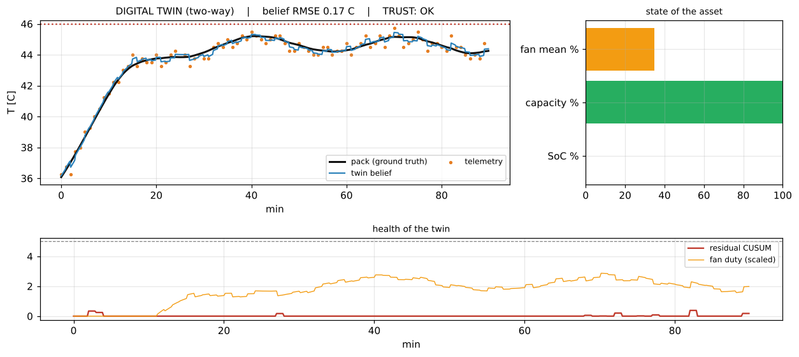
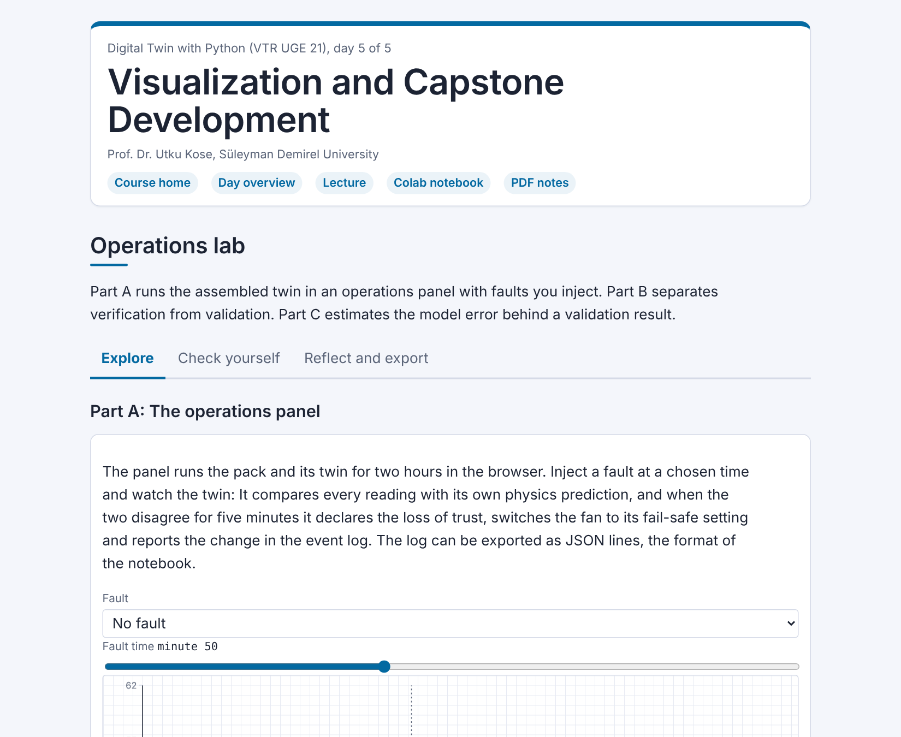

# Day 05: Visualization and Capstone Development

**Digital Twin with Python (VTR UGE 21)**  
Prof. Dr. Utku Kose, Süleyman Demirel University

   

A dashboard for the operator, maturity computed from the state of the twin, verification and validation, a credibility scorecard and the assembled twin under a fault. **Estimated study time:** 6 to 8 hours.

## Materials of the day

Each material has its own role. Start with the lecture page; the study path below gives the order and the time of each step.

| Material | What it holds | Open |
|---|---|---|
| Lecture page | The concepts of the day, with animations, knowledge checks, review cards and the references | [Lecture page](https://utkukose.github.io/digital-twin-veltech-NB-lecture/days/day-05/lecture.html) |
| Colab notebook | Python step 5: Classes, records and files, then the hands-on sections with exercises, an application switch and the application challenges |  |
| Interactive lab | Operations lab: Three practice parts, a self-assessment and an exportable learning log | [Interactive lab](https://utkukose.github.io/digital-twin-veltech-NB-lecture/days/day-05/lab.html) |
| PDF lecture notes | The lecture and the Python step in one printable file | [PDF notes](Day05_Lecture_Notes.pdf) |

<table><tr><td width="50%"> From the Colab notebook</td><td width="50%"> The interactive lab</td></tr></table>

## Learning outcomes

By the end of the day, students are expected to build an operator dashboard that shows state, trust and alarms, to freeze a configuration and attach its fingerprint to every logged record, to compute the maturity level of a twin from its data flows and its trust in itself, to verify code and solution numerically, to validate a model and compute the model error implied above the noise of the sensor, to fill a credibility scorecard with evidence and open items, and to run an assembled twin through a fault and interpret its fail-safe behaviour. In Python, students are expected to write classes and frozen dataclasses, to log records as JSON lines, one record per line in the JavaScript Object Notation, and to read them back with pandas.

## Study path

| Step | Activity | Suggested time |
|---|---|---|
| 1 | Read the [lecture page](https://utkukose.github.io/digital-twin-veltech-NB-lecture/days/day-05/lecture.html) and answer its knowledge checks | 1 hour 30 minutes |
| 2 | Work through parts A, B and C of the [interactive lab](https://utkukose.github.io/digital-twin-veltech-NB-lecture/days/day-05/lab.html) | 45 minutes |
| 3 | Run Python step 5: Classes, records and files in the [Colab notebook](https://colab.research.google.com/github/utkukose/digital-twin-veltech-NB-lecture/blob/main/days/day-05/NB05_visualization_and_capstone.ipynb#scrollTo=python-step), right after the setup cell | 1 hour |
| 4 | Work through the numbered sections of the notebook and their exercises | 2 hours 30 minutes |
| 5 | Use the application switch of the notebook and solve the application challenge of your field | 45 minutes |
| 6 | Take the self-assessment in the [interactive lab](https://utkukose.github.io/digital-twin-veltech-NB-lecture/days/day-05/lab.html) (tab: Check yourself) | 20 minutes |
| 7 | Write the reflection in the lab, export the learning log and complete the daily task below | 45 minutes |

## Live session plan

The day runs as one synchronous session in class or online, and each material has one role in it. The lecture page is on the screen, and at each orange Colab box the instructor shows the matching section in a copy of the notebook that has already been run. Students work in their own copy of the notebook from top to bottom, and each lab part follows the lecture part it practises. The PDF lecture notes serve reading after the session, and the study path above serves self-paced study.

| Time | Activity |
|---|---|
| 0:00 to 0:10 | Opening: Recap of the week: The parts of the twin and what each one was measured against. Students open the notebook in Colab, save a copy and run section 0 |
| 0:10 to 0:45 | Lecture page, part 1: The operator's dashboard, maturity computed from the state with its animation, configuration and the event log |
| 0:45 to 1:10 | Colab, together: Python step 5, ending with a log read back into a data frame |
| 1:10 to 1:20 | Break |
| 1:20 to 1:55 | Lecture page, part 2: Verification and validation with the validation animation, the credibility scorecard, the assembled twin under a fault; then lab Part B with the whole class and Part C by hand |
| 1:55 to 2:30 | Colab, in pairs: Sections 1 to 7 with their exercises, then section 8 with a different asset and a worn fan |
| 2:30 to 3:00 | Lab and closing: Part A, the operations panel with injected faults, section 9 with the final project, questions and the course evaluation |

## Daily task and submission

Run the assembled twin of section 7 with two other faults of your choice, for example a sensor bias and a stuck fan. For each, report when trust is lost, the peak temperature and the maturity at the end, and update one row of the credibility scorecard with the new evidence. Write about 200 words on which fault the twin handles worst and why.

The task is optional and supports self-learning and a personal portfolio. During an active delivery of the course, it can be sent together with the exported learning log to utkukose@sdu.edu.tr or utkukose@gmail.com.

## Research and report assignment (optional)

**Verification, validation and credibility of digital twins.** Review how published digital twins report verification, validation and uncertainty &#91;[1](https://utkukose.github.io/digital-twin-veltech-NB-lecture/days/day-05/lecture.html#ref-1), [2](https://utkukose.github.io/digital-twin-veltech-NB-lecture/days/day-05/lecture.html#ref-2), [3](https://utkukose.github.io/digital-twin-veltech-NB-lecture/days/day-05/lecture.html#ref-3)&#93;. Classify the studies by the elements of the scorecard of the day they address and identify the most common gap. The report should be about 1500 words with at least eight sources.
